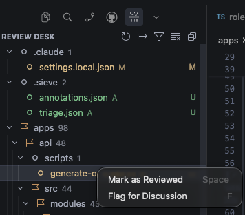
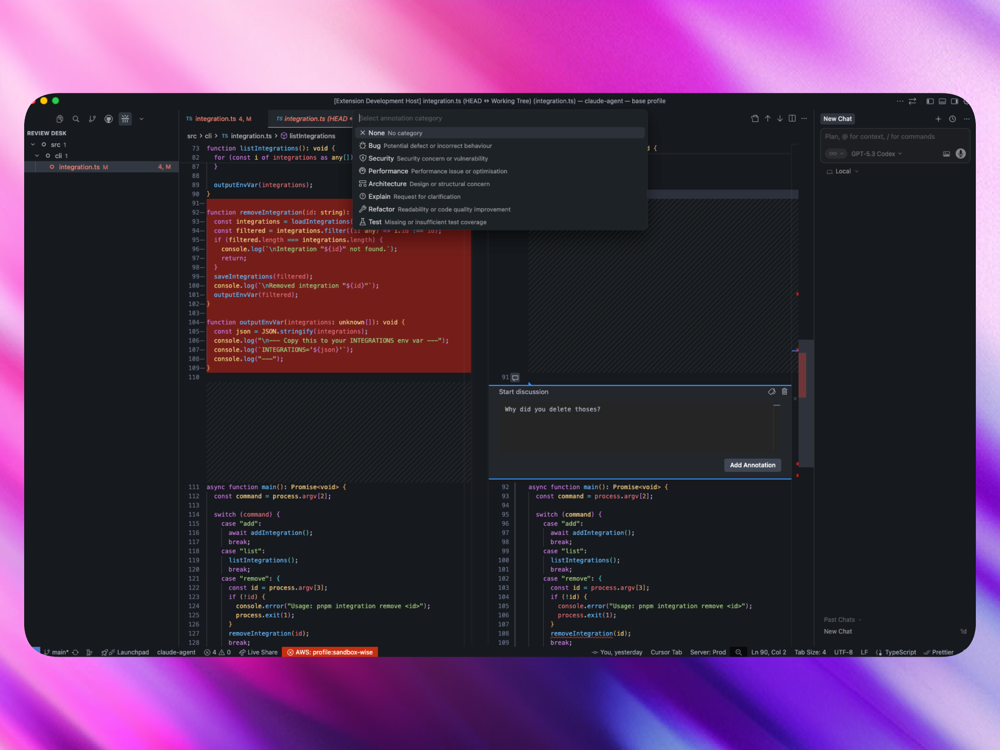
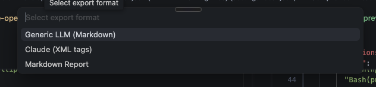

<p align="center">
  
</p>

<h1 align="center">Sieve</h1>

<p align="center">
  <strong>Filter AI slop before it hits your codebase.</strong>
</p>

<p align="center">
  <a href="https://marketplace.visualstudio.com/items?itemName=DanielT777.sieve">
    
  </a>
  <a href="https://github.com/DanielT777/sieve/blob/main/LICENSE">
    
  </a>
  
  
</p>

<p align="center">
  <a href="#get-started">Get Started</a> &bull;
  <a href="#features">Features</a> &bull;
  <a href="#keyboard-shortcuts">Keyboard Shortcuts</a> &bull;
  <a href="#contributing">Contributing</a> &bull;
  <a href="#roadmap">Roadmap</a>
</p>

---

AI assistants modify 10–50+ files in seconds. But then you're left eyeballing a massive diff, hoping nothing slipped through. **Sieve is a local PR review for AI-generated code** — triage, annotate, and export structured feedback, all without leaving your editor.

---

## Get Started

1. **Install** — Extensions (`Ctrl+Shift+X`) → search **"Sieve"** → Install
2. **Open** a project where AI has made changes
3. **Click the Sieve icon** in the Activity Bar — done

Or grab the [`.vsix` from the latest release](https://github.com/DanielT777/sieve/releases/latest) and install manually:
```bash
code --install-extension sieve-0.1.0.vsix
```

> Works with VS Code, Cursor, Windsurf, VSCodium. No configuration needed.

---

## Features

### Review Desk

All changed files in one panel. Triage them one by one — `Space` to approve, `F` to flag.

<p align="center"></p>

- Auto-detects staged + unstaged changes from git
- Tree view grouped by directory with git status badges (A, M, D, R)
- Filter by status: All / Unreviewed / Reviewed / Flagged
- Progress in the status bar: `12/47 reviewed`

---

### Pre-prompted Annotation Categories

Click the `+` gutter on any changed line. Pick a category — each one generates tailored instructions when you export.

<p align="center"></p>

| Category | What it tells the LLM |
|---|---|
| **Bug** | Identify root cause, suggest minimal fix |
| **Security** | Assess OWASP risk, provide remediation |
| **Performance** | Profile the bottleneck, suggest optimization |
| **Architecture** | Evaluate design impact, propose alternative |
| **Explain** | Clarify intent and reasoning |
| **Refactor** | Improve readability, reduce complexity |
| **Test** | Add missing coverage |

Cycle categories with the tag button. Power users can type `[bug] your text` directly.

---

### Export to LLM — Like Reviewing a Friend's PR

Flag files, add annotations, press `E`. Sieve builds a structured prompt with your diffs + annotations and copies it to your clipboard. Paste it into Claude, ChatGPT, or any LLM — it reads like a thorough code review from a colleague.

<p align="center"></p>

Three formats:

| Format | Best for |
|---|---|
| **Claude (XML)** | Claude Code, Claude Chat |
| **Generic LLM** | ChatGPT, Copilot Chat, any LLM |
| **Markdown Report** | Docs, Slack, Notion |

Each export includes full file content, hunk-level diffs, your annotations matched to the relevant code, and auto-generated instructions based on the categories you used.

<details>
<summary>Example output (Claude XML)</summary>

```xml
<review>
<instructions>
For each [bug]: identify the root cause and suggest a minimal, targeted fix.
For each [security]: assess the OWASP risk level and provide a concrete remediation.
</instructions>

<file path="src/hooks/useAuth.ts" status="modified">
  <content>
  1: import { useEffect, useState } from 'react';
  2: ...
  </content>
  <hunk header="@@ -23,5 +23,7 @@">
    <diff>
+useEffect(() => {
+  const sub = auth.onStateChange(setUser);
+}, []);
    </diff>
    <annotation line="24" category="bug">
      Missing cleanup — will cause memory leak on unmount
    </annotation>
  </hunk>
</file>
</review>
```

</details>

---

### 3-State Triage

| State | Shortcut | Meaning |
|---|---|---|
| &#x2B1C; Unreviewed | — | Not yet looked at |
| &#x2705; Reviewed | `Space` | Approved |
| &#x1F6A9; Flagged | `F` | Needs attention — prompts for an annotation |

Press the same shortcut again to revert to unreviewed. State persists across restarts.

---

### The Loop

```
 AI generates code
       |
       v
 You review in Sieve ──> Flag + annotate
       ^                       |
       |                       v
 Re-review  <────────  Export to LLM ──> AI fixes issues
```

Works with Claude Code, Cursor, Copilot, Cline, Aider, Codex — any tool that writes code.

---

## Keyboard Shortcuts

Scoped to the Review Desk panel — zero conflicts with your keybindings.

| Key | Action |
|---|---|
| `Space` | Toggle reviewed |
| `F` | Toggle flagged |
| `Enter` | Open diff |
| `E` | Export flagged files |
| `F5` | Refresh |

---

## Privacy

- **Zero cloud** — everything runs locally
- **Zero telemetry** — no data collection
- **Zero network** — no outbound connections

---

## Contributing

```bash
git clone https://github.com/DanielT777/sieve.git
cd sieve
pnpm install
pnpm run compile:watch  # terminal 1
# Press F5 to launch Extension Development Host
pnpm test
```

## Roadmap

- [ ] Direct LLM API integration (send & receive without leaving the editor)
- [ ] MCP server for bidirectional AI communication
- [ ] Custom export templates
- [ ] Team review session sharing

## License

[MIT](LICENSE)

---

<p align="center">
  <strong>If Sieve saves you from merging slop, <a href="https://github.com/DanielT777/sieve">star it on GitHub</a></strong>
</p>
